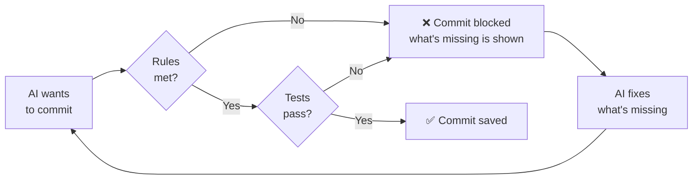

<div align="center">

# 🧭 Waypoint

### Finish projects with AI, without coding and without getting lost.

A way of working for Claude Code, Codex, Antigravity and other AI coding tools.
Installs with one command and moves your project forward in small, saved and tested steps.

🌐 [waypoint.eren.ink/en](https://waypoint.eren.ink/en/) · **English** · [Türkçe](README.tr.md)

</div>

> Waypoint is Turkish-first: the project notes inside `.waypoint/` (progress log, lessons, map) are kept in Turkish. Commands work in English too, and the AI answers in English if you write in English.

---

## Why?

If you build projects with AI, some of this may sound familiar:

- 😵 In a new session you don't remember **where you left off**, so you explain everything again.
- 🐇 Halfway through a task you get a new idea, jump to it, and **the first job stays half done**.
- 💥 Fixing one thing **breaks something else** and you don't notice.
- 🔁 The AI makes **the same mistake again and again**.
- 🤷 It says "done", but it's unclear **what is done**.

Waypoint puts a rule and a check on each of these. The rules aren't requests: they are **checked automatically** at commit time.

## What it does

| | |
|---|---|
| 🎯 **One task** | The plan is split into small tasks and only one is worked on at a time. New ideas are parked as one line in a "later" list; details of longer ideas go to `FIKIRLER.md`. |
| 🧱 **Small steps** | Each change does one thing and is its own save point. A step that breaks something can be undone on its own. |
| ☁️ **Automatic backup** | If the project has a GitHub remote, every commit is pushed automatically. Experiments and parallel work live on separate branches. |
| 🧪 **Automatic tests** | Important features get tests, and they run before every commit. If the tests fail, the commit is **refused**. Until a test command is set, every commit that changes code warns that no tests ran. |
| 📒 **Progress log** | Goal, plan, decisions and a daily log in one file. On a day the code changes, the commit is **refused** until the log is written. Old entries move to an archive, so the log stays short. |
| 🗺️ **Project map** | Important functions and how they connect, as a diagram that shows up as a picture in Obsidian. A new function missing from the map **can't be committed** (in common languages like JavaScript/TypeScript, Python, Go, Rust, Java, C#, Kotlin, Swift, PHP, Ruby). A function deleted from the code or listed under the wrong file **can't stay** in the map. When a mapped function changes, the AI is reminded to check its connections. |
| 📝 **Lessons** | Rules learned from the AI's mistakes. Fix commits remind it to write a lesson. |
| 🏷️ **Tidy commits** | Every commit is in English and in the standard [Conventional Commits](https://www.conventionalcommits.org) format: `feat: add expense form`, `fix: prevent empty tasks`, `docs: …`. A bug fix without a test **can't be committed**. |
| 🔤 **Broken character guard** | Files and commit messages with garbled (wrongly encoded) Turkish letters **can't be committed**. |
| 🔒 **Secret protection** | `.env`, key, certificate and service account files **can't be committed**. GitHub/AWS/Google/AI keys and private keys pasted into code are caught too. |
| 💬 **Plain language** | The AI talks to you without jargon, short and clear, in the language you write in. |

## Install

Open a terminal in your project folder and paste one command.

**Windows (PowerShell):**
```powershell
irm https://raw.githubusercontent.com/erenuzman/WaypointSkill/main/install.ps1 | iex
```

**macOS / Linux:**
```bash
curl -fsSL https://raw.githubusercontent.com/erenuzman/WaypointSkill/main/install.sh | sh
```

That's it. Now open your AI tool in the same folder and say what you want to build. Waypoint handles the rest: it clarifies the goal first, has you approve the plan, then goes step by step.

### Requirements

- **Git**: for save points. [Download](https://git-scm.com)
- **Python 3.10+** (required): the rule checks run on Python. Without Python the checks aren't skipped: **commits are blocked** and you're told how to install it. On Windows, tick "Add python.exe to PATH" during setup. [Download](https://www.python.org/downloads/)

### Updating

You don't need to watch for new versions. Waypoint checks once a day. If there is one, the AI tells you what's new and asks whether to install it. Nothing is installed without your OK. The installed version is in `.waypoint/VERSION`, and what's new is in [CHANGELOG.md](CHANGELOG.md).

To update right away there are two ways. Both update the rules and checks; your progress, lessons and map files are **never touched.**

**1. Tell the AI (easiest).** Open your AI tool in the project and type:

```
update Waypoint
```

The AI explains what's new in plain words and asks you to double-click `.waypoint/guncelle.bat` (on macOS, `guncelle.command`). When it's done, you write "updated" and the AI saves the result as its own commit. The AI doesn't run the installer itself, so the choice to run code from the internet stays yours.

> If you installed Waypoint before 1.9, this file doesn't exist yet. Use way 2 once; after that, double-clicking is enough.

**2. Run the command yourself.** Open a terminal in your project folder and paste the install command again:

**Windows (PowerShell):**
```powershell
irm https://raw.githubusercontent.com/erenuzman/WaypointSkill/main/install.ps1 | iex
```

**macOS / Linux:**
```bash
curl -fsSL https://raw.githubusercontent.com/erenuzman/WaypointSkill/main/install.sh | sh
```

Then ask the AI to commit the changes.

## What gets added to your project?

```
your-project/
├── AGENTS.md          ← one-line pointer for Codex, Antigravity etc.
├── CLAUDE.md          ← one-line pointer for Claude Code
└── .waypoint/
    ├── KURALLAR.md    ← the working rules the AI follows
    ├── komutlar/      ← longer how-tos (finish, update…), read when needed
    ├── VERSION        ← installed Waypoint version
    ├── ILERLEME.md    ← goal, plan, decisions, daily log
    ├── DERSLER.md     ← rules learned from mistakes
    ├── HARITA.md      ← important functions + diagram
    ├── raporlar/      ← reports written by the AI (dated)
    ├── WAYPOINT_GUNLUGU.md ← is Waypoint helping? (session notes)
    ├── oto-kayit.log  ← every commit and block, logged automatically (only on your computer)
    └── hooks/         ← checks that run at commit time
```

Everything Waypoint owns is in one folder. It doesn't mess with your files.

## Commands

Type these to the AI any time. Most have a one-word short form, and the Turkish forms work too. A one-word short form counts only when it is the whole message.

| Command | Short | Turkish | What happens |
|---|---|---|---|
| `where are we` | `where` | `neredeyiz` | Summary of the goal, the plan, what's happening now and the next step. |
| `just a question` | `ask` | `sadece soru` / `sos` | The AI only answers and changes nothing. |
| `what did we do` | `recap` | `ne yaptık` / `nep` | The last action, briefly and in plain words. |
| `what's next` | `next` | `sırada ne var` / `snv` | Only the next step, in one sentence. |
| `park <idea>` | | `sonraya ekle <fikir>` / `parket` | A new idea goes to the "later" list without interrupting the current work. |
| `list` | | `liste` | Done and remaining tasks, one under the other. |
| `how do I run it` | `run` | `nasıl açarım` | The steps to run the project. |
| `show the map` | `map` | `haritayı göster` | The project map drawn as boxes and arrows. |
| `clarify` | | `sorgula` | An idea or new feature gets clear through questions, one at a time (about 10 at most). Done automatically at the start of a project and for big features. |
| `finish` | | `bitir` | Loose ends tied up, notes updated, a commit made and a summary of the day. |
| `update Waypoint` | | `Waypoint'i güncelle` | The latest Waypoint is installed and what's new is explained in plain words. |

To see the map yourself, open the project folder in **Obsidian** and look at `.waypoint/HARITA.md`. The diagram shows up as a picture.

## How do the checks work?

The checks are tied to **git**, not to the AI tool. So whatever tool you use, they work the same way on every commit:



## FAQ

**Do I need to know how to code?**
No. Waypoint is designed for people who don't code. You say what you want, try it, and say "it works" or "it doesn't".

**Do I need to speak Turkish?**
No. Commands work in English and the AI answers in English if you write in English. Only the notes inside `.waypoint/` are kept in Turkish.

**Which AI tools does it work with?**
Any tool that reads `AGENTS.md` (Codex, Antigravity, Cursor…) and Claude Code through `CLAUDE.md`. Since the checks are tied to git, they work in all of them.

**Can I add it to an existing project?**
Yes. If `AGENTS.md` and `CLAUDE.md` exist, their content is kept and only a Waypoint pointer is added at the end. The project's own git hooks (Husky etc.) keep running before Waypoint's checks.

**How do I remove Waypoint from a project?**
Delete the `.waypoint` folder, remove the Waypoint line from `AGENTS.md` and `CLAUDE.md`, and run this in a terminal:
```bash
git config --unset core.hooksPath
```

---

<div align="center">
<sub>Waypoint · small steps, saved progress, no getting lost.</sub>
</div>
