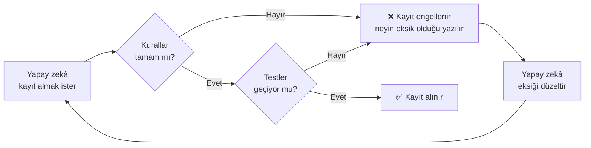

<div align="center">

# 🧭 Waypoint

### Kod bilmeden, yapay zekâyla, kaybolmadan proje bitir.

Claude Code, Codex, Antigravity ve diğer yapay zekâ araçları için Türkçe çalışma düzeni.
Tek komutla kurulur; projeyi küçük, kayıtlı ve test edilmiş adımlarla ilerletir.

🌐 [waypoint.eren.ink](https://waypoint.eren.ink) · [English](README.md) · **Türkçe**

</div>

---

## Neden?

Yapay zekâyla proje yaparken şunlar tanıdık gelebilir:

- 😵 Yeni oturumda **nerede kaldığını** hatırlamıyorsun, her şeyi baştan anlatıyorsun.
- 🐇 Bir işin ortasında aklına yeni bir fikir geliyor, ona atlıyorsun, **ilk iş yarım kalıyor**.
- 💥 Bir şeyi düzeltirken **başka bir şey bozuluyor** ve fark etmiyorsun.
- 🔁 Yapay zekâ **aynı hatayı tekrar tekrar** yapıyor.
- 🤷 "Bitti" deniyor ama **neyin bittiği** belli değil.

Waypoint bunların her birine bir kural ve bir kontrol koyar. Kurallar rica değil: kayıt anında **otomatik olarak denetlenir.**

## Ne yapar?

| | |
|---|---|
| 🎯 **Tek görev** | Plan küçük görevlere bölünür; aynı anda tek görev yapılır. Yeni fikirler "Sonra yapılacaklar" listesine tek satır olarak park edilir; uzun fikirlerin ayrıntısı `FIKIRLER.md`'ye yazılır. |
| 🧱 **Küçük adımlar** | Her değişiklik tek bir iş yapar ve ayrı bir kayıt noktasıdır. Bozulan adım tek başına geri alınır. |
| ☁️ **Otomatik yedek** | Projenin GitHub bağlantısı varsa her kayıt kendiliğinden GitHub'a yüklenir. Deneysel ya da aynı anda yürüyen işler ayrı dallarda (branch) tutulur. |
| 🧪 **Otomatik testler** | Önemli özelliklerin testi yazılır ve her kayıttan önce çalışır. Testler geçmezse kayıt **alınmaz**. Test komutu henüz yoksa, kod değişen her kayıtta "testler çalışmadı" uyarısı çıkar. |
| 🖱️ **Canlı kontrol** | Sen bir siteyi ya da web uygulamasını denemeden önce yapay zekâ onu kendi tarayıcısında açıp tıklayarak dener. Tarayıcısı yoksa "çalışıyor" demez, bakamadığını söyler. |
| 📒 **İlerleme defteri** | Hedef, plan, kararlar ve günlük tek dosyada. Kod değiştiği gün günlüğe yazılmadan kayıt **alınmaz**. Defter büyüyünce eski kayıtlar arşive taşınır, hep kısa kalır. |
| 🗺️ **Proje haritası** | Önemli fonksiyonlar ve bağlantıları, Obsidian'da resim olarak görünen bir şemayla. Haritada olmayan yeni bir fonksiyon önemliyse eklemesi için yapay zekâya hatırlatılır (JavaScript/TypeScript, Python, Go, Rust, Java, C#, Kotlin, Swift, PHP, Ruby gibi yaygın dillerde). Koddan silinmiş ya da yanlış dosyaya yazılmış fonksiyon haritada **kalamaz**. Haritadaki bir fonksiyon değişince bağlantılarını kontrol etmesi için yapay zekâya hatırlatılır. |
| 📝 **Dersler** | Yapay zekânın hatalarından çıkan kurallar. |
| 🏷️ **Düzenli kayıtlar** | Her kayıt İngilizce ve standart [Conventional Commits](https://www.conventionalcommits.org) biçiminde: `feat: add expense form`, `fix: prevent empty tasks`, `docs: …`. Testsiz hata düzeltmesi kayda **giremez**. |
| 🔤 **Bozuk karakter koruması** | Türkçe harfleri bozulmuş (yanlış kodlanmış) dosyalar ve kayıt mesajları kayda **giremez**. |
| 🔒 **Gizli bilgi koruması** | `.env`, anahtar, sertifika ve servis hesabı dosyaları kayda **giremez**. Koda gömülü GitHub/AWS/Google/yapay zekâ anahtarları ve özel anahtarlar da yakalanır. |
| 🇹🇷 **Sade Türkçe** | Yapay zekâ seninle teknik terim kullanmadan, kısa ve net konuşur. |

## Kurulum

Projenin klasöründe bir terminal aç ve tek komutu yapıştır.

**Windows (PowerShell):**
```powershell
irm https://raw.githubusercontent.com/1eren0/WaypointSkill/main/install.ps1 | iex
```

**macOS / Linux:**
```bash
curl -fsSL https://raw.githubusercontent.com/1eren0/WaypointSkill/main/install.sh | sh
```

Bitti. Şimdi aynı klasörde yapay zekâ aracını aç ve ne yapmak istediğini anlat. Gerisini Waypoint yönetir: önce hedefi netleştirir, sonra planı sana onaylatır, sonra adım adım yapar.

### Gerekenler

- **Git**: kayıt noktaları için. [İndir](https://git-scm.com)
- **Python 3.10+** (zorunlu): kural kontrolleri Python ile çalışır. Python yoksa kontroller atlanmaz, **kayıt engellenir** ve nasıl kurulacağı söylenir. Windows'ta kurarken "Add python.exe to PATH" kutusunu işaretle. [İndir](https://www.python.org/downloads/)

### Güncelleme

Yeni sürüm çıkınca kendin takip etmene gerek yok. Waypoint günde bir kez yeni sürüm var mı diye bakar. Varsa yapay zekâ sana yenilikleri anlatır ve "kurayım mı?" diye sorar. Sen onay vermeden hiçbir şey kurulmaz. Kurulu sürüm `.waypoint/VERSION` dosyasında yazar, yenilikler [CHANGELOG.md](CHANGELOG.md) dosyasında.

Beklemeden hemen güncellemek istersen iki yol var. İkisinde de kurallar ve kontroller güncellenir; senin ilerleme, ders ve harita dosyalarına **dokunulmaz.**

**1. Yapay zekâya söyle (en kolayı).** Projede yapay zekâ aracını aç ve şunu yaz:

```
Waypoint'i güncelle
```

Yapay zekâ yenilikleri sade Türkçe anlatır ve senden `.waypoint/guncelle.bat` dosyasına (macOS'ta `guncelle.command`) çift tıklamanı ister. Kurulum bitince "güncelledim" yazarsın, o da sonucu ayrı bir kayıt olarak alır. İnternetten gelen kodu çalıştırma kararı sende olsun diye kurulumu yapay zekâ kendisi çalıştırmaz.

> Waypoint'i 1.9'dan eski bir sürümle kurduysan bu dosya henüz yok. O zaman bir kereliğine 2. yolu kullan; sonraki güncellemelerde çift tıklamak yeter.

**2. Komutu kendin çalıştır.** Projenin klasöründe bir terminal aç ve kurulum komutunu tekrar yapıştır:

**Windows (PowerShell):**
```powershell
irm https://raw.githubusercontent.com/1eren0/WaypointSkill/main/install.ps1 | iex
```

**macOS / Linux:**
```bash
curl -fsSL https://raw.githubusercontent.com/1eren0/WaypointSkill/main/install.sh | sh
```

Sonra yapay zekâdan değişiklikleri kaydetmesini iste.

## Projene ne eklenir?

```
projen/
├── AGENTS.md          ← Codex, Antigravity vb. için tek satırlık yönlendirme
├── CLAUDE.md          ← Claude Code için tek satırlık yönlendirme
└── .waypoint/
    ├── KURALLAR.md    ← yapay zekânın uyduğu çalışma kuralları
    ├── komutlar/      ← her durumun tarifi (hata, teslim, bitir…), o durum gelince okunur
    ├── VERSION        ← kurulu Waypoint sürümü
    ├── ILERLEME.md    ← hedef, plan, kararlar, günlük
    ├── DERSLER.md     ← hatalardan çıkan kurallar
    ├── HARITA.md      ← önemli fonksiyonlar + şema
    ├── raporlar/      ← yapay zekânın yazdığı raporlar (tarihli)
    ├── WAYPOINT_GUNLUGU.md ← Waypoint işe yarıyor mu? (oturum notları)
    ├── oto-kayit.log  ← her kayıt ve engel kendiliğinden yazılır (sadece bilgisayarında)
    └── hooks/         ← kayıt anında çalışan kontroller
```

Waypoint'e ait her şey tek klasörde. Senin dosyalarına karışmaz.

## Kullanırken

Yapay zekâya istediğin zaman şunları yazabilirsin:

| Komut | Ne olur |
|---|---|
| `neredeyiz` (İngilizce: `where`) | Hedef, plan, şu an ne yapıldığı ve sıradaki adım özetlenir. |
| `sadece soru` (kısaca `sos`, İngilizce: `ask`) | Yapay zekâ sadece cevap verir, hiçbir şeyi değiştirmez. |
| `ne yaptık` (kısaca `nep`, İngilizce: `recap`) | Son yapılan işlem kısaca, sade dille anlatılır. |
| `sırada ne var` (kısaca `snv`, İngilizce: `next`) | Sadece sıradaki adım tek cümleyle söylenir. |
| `sonraya ekle <fikir>` (kısaca `parket`, İngilizce: `park`) | Yeni fikir, mevcut iş bölünmeden "Sonra yapılacaklar"a yazılır. |
| `liste` (İngilizce: `list`) | Yapılanlar ve yapılacaklar alt alta gösterilir. |
| `nasıl açarım` (İngilizce: `run`) | Projeyi çalıştırma adımları gösterilir. |
| `haritayı göster` (İngilizce: `map`) | Projenin haritası kutular ve oklarla çizilir. |
| `sorgula` (İngilizce: `clarify`) | Fikir ya da yeni özellik, tek tek sorularla netleştirilir (en fazla ~10 soru). Proje başında ve büyük özelliklerde kendiliğinden yapılır. |
| `bitir` (İngilizce: `finish`) | Yarım iş toparlanır, defterler güncellenir, kayıt alınır, günün özeti çıkar. |
| `Waypoint'i güncelle` (İngilizce: `update Waypoint`) | Waypoint'in en yeni sürümü kurulur, yenilikler sade dille anlatılır. |

Haritayı kendin görmek istersen proje klasörünü **Obsidian**'da aç ve `.waypoint/HARITA.md` dosyasına bak. Şema resim olarak görünür.

## Kontroller nasıl çalışır?

Kontroller yapay zekâ aracına değil **git**'e bağlıdır. Bu yüzden hangi aracı kullanırsan kullan, her kayıtta aynı şekilde çalışırlar:



## Sık sorulanlar

**Kod bilmem gerekiyor mu?**
Hayır. Waypoint tam olarak kod bilmeyenler için tasarlandı. Sen ne istediğini söylersin, denersin, "çalışıyor" ya da "çalışmıyor" dersin.

**Hangi yapay zekâ araçlarıyla çalışır?**
`AGENTS.md` dosyasını okuyan her araçla (Codex, Antigravity, Cursor…) ve `CLAUDE.md` üzerinden Claude Code ile. Kontroller git'e bağlı olduğu için hepsinde çalışır.

**Mevcut bir projeye kurabilir miyim?**
Evet. Varsa `AGENTS.md` ve `CLAUDE.md` dosyalarının içeriği korunur, sonuna sadece Waypoint yönlendirmesi eklenir. Projenin kendi kayıt kontrolleri (Husky gibi) de Waypoint'in kontrollerinden önce çalışmaya devam eder.

**Waypoint'i projeden nasıl kaldırırım?**
`.waypoint` klasörünü sil, `AGENTS.md` ve `CLAUDE.md` içindeki Waypoint satırını kaldır ve terminalde şunu çalıştır:
```bash
git config --unset core.hooksPath
```

---

<div align="center">
<sub>Waypoint · küçük adımlar, kayıtlı ilerleme, kaybolmak yok.</sub>
</div>
